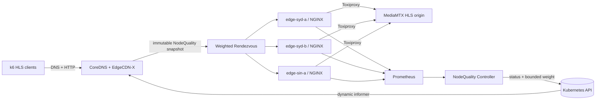
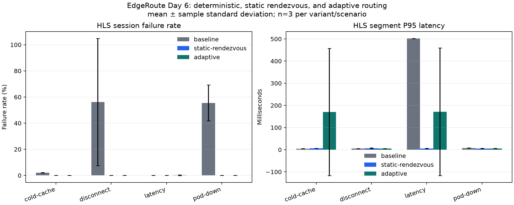

# EdgeRoute

EdgeRoute extends the EdgeCDN-X CoreDNS routing plugin with telemetry-driven node scoring, bounded outlier ejection, weighted rendezvous selection, and gradual cache-node recovery.

The repository is an **extension of [EdgeCDN-X/edgecdnx-plugin](https://github.com/EdgeCDN-X/edgecdnx-plugin)**, not a from-scratch CDN. It composes mature infrastructure—CoreDNS, Kubernetes, Prometheus, NGINX, MediaMTX, Toxiproxy, and k6—and adds the quality-control and routing logic needed to connect them safely.



The logical Sydney/Singapore topology runs on one three-node kind cluster. Prometheus is never queried in the DNS request path: the controller writes `NodeQuality.status`, and CoreDNS serves from an atomically published immutable snapshot.

## What this fork adds

- A namespaced `NodeQuality` CRD with schema, status subresource, observed state, versioned effective weight, and recovery metadata.
- A Go quality controller that combines configurable PromQL signals with EWMA smoothing, sample gates, consecutive-failure/error-rate ejection, per-location ejection limits, stale/last-known-good behavior, persistent cooldown, and staged recovery.
- Three explicit routing modes for controlled experiments:
  - `deterministic`: upstream modulo-hash selection with existing active-health and geographic fallback;
  - `static-rendezvous`: equal-weight rendezvous with the same health/fallback behavior and no NodeQuality input;
  - `adaptive`: NodeQuality-weighted rendezvous with ejection and recovery.
- An allocation-free DNS selection path using `/24` IPv4 and `/56` IPv6/ECS routing keys, `xxhash/v2`, dynamic informers, and `atomic.Pointer` snapshots.
- Bounded-cardinality CoreDNS/controller metrics for routing, fallback, unavailability, reconcile outcomes, and snapshot age.
- A reproducible HLS lab with one MediaMTX origin, three independent NGINX caches, Prometheus exporters, Toxiproxy fault injection, and k6 traffic.
- Strict experiment identity checks that bind every result to one Git commit, image ID, Job UID, Pod, run ID, profile, host, and non-empty Prometheus response.

Upstream geographic routing, EdgeCDN-X CRDs, CoreDNS, NGINX caching, streaming, monitoring, fault injection, and load generation remain upstream or third-party capabilities. See [UPSTREAM.md](UPSTREAM.md) and [NOTICE.md](NOTICE.md) for the boundary.

## Five-minute Quick Start

Prerequisites: Docker, Go 1.25, GNU Make, PowerShell 7 (`pwsh`), `kubectl`, kind 0.33, and Helm 3.21. The commands use the pinned versions and image digests in `versions.env` and the Makefile.

For a new machine, create the local cluster and install the pinned mature dependencies:

```bash
make kind-up
make install-crds
make monitoring
make load-images
make deploy stream-start
```

Then run the core demonstration:

```bash
make smoke-test
make e2e
```

`make smoke-test` proves that all three caches serve a real playlist and the same completed segment transitions `MISS -> HIT`. `make e2e` runs one isolated adaptive latency-fault test, verifies k6 identity and failure rate, requires non-empty Prometheus telemetry, restores adaptive mode, and writes temporary evidence under `.tmp/`.

`make deploy` uses server-side apply with `--force-conflicts` only for fields declared under `deploy/`. This deliberately returns the lab to the committed Corefile and image after an experiment runner has temporarily patched those same fields.

With tool images already cached, the two core demo commands complete in about five minutes on the recorded workstation. First bootstrap is slower because it downloads CoreDNS source, container images, and the pinned kube-prometheus-stack chart. `make quick-start` runs the entire new-cluster sequence; it is intentionally not idempotent because `kind-up` must fail if the requested cluster already exists.

Run the scripted presentation instead:

```powershell
pwsh -NoProfile -File scripts/demo.ps1
```

## Recorded fault experiment

The published smoke matrix contains 36 runs: 3 policies × 4 faults × 3 repetitions. All 36 have unique Job UIDs and Pods, matching directory/metadata/k6 run IDs, k6 exit code 0, P99 data, and 6–12 Prometheus series. Reprocessing the raw files twice produced identical SHA-256 hashes for every derived artifact.



Selected recorded results from [the generated report](experiments/results/processed/report.md):

| Fault | Deterministic session failures | Static rendezvous | Adaptive |
|---|---:|---:|---:|
| disconnect | 56.18% | 0.00% | 0.00% |
| pod down | 55.52% | 0.00% | 0.00% |
| cold cache | 2.05% | 0.00% | 0.00% |
| added latency | 0.00% | 0.00% | 0.18% |

These are low-concurrency `smoke` observations (2–5 VUs for 18 seconds), not production SLO or throughput claims. In this sample, adaptive segment P95 was worse than static rendezvous for added latency and cold cache; the repository preserves that negative result instead of claiming universal performance improvement.

Reproduce the complete smoke matrix and derived report:

```powershell
pwsh -NoProfile -File experiments/run-day6.ps1 -Profile smoke -Repetitions 3
python -m pip install -r experiments/requirements.txt
python experiments/process_results.py
```

## Algorithm and safety model

The controller uses standard mechanisms rather than reimplementing infrastructure or hash primitives:

- EWMA smooths observed latency/error signals; the repository defines the signals, sample gates, thresholds, and state transitions.
- Outlier ejection follows the safety shape used by Envoy-style passive health handling: consecutive failures and error rate can eject, while a per-location maximum prevents all local nodes being removed together.
- Weighted Rendezvous uses the exponential-rank formulation `-ln(u) / weight` and the maintained [`cespare/xxhash`](https://github.com/cespare/xxhash) implementation.
- Recovery publishes bounded 10%/25%/50%/100% capacity steps so a cold cache is not returned to full traffic immediately.
- Controller or Prometheus failure keeps DNS independent: request goroutines use last-known-good snapshot data, then bounded stale behavior and geographic fallback.

Exact formulas, candidate filtering order, routing-key privacy, references, and measured benchmarks are in [docs/algorithm.md](docs/algorithm.md). The full component and failure boundaries are in [docs/architecture.md](docs/architecture.md) and [docs/failure-analysis.md](docs/failure-analysis.md).

The exact verification record for the current release is in [docs/verification.md](docs/verification.md). The project release tag is `edgeroute-v0.1.0`; the inherited upstream `v0.1.0` tag is intentionally preserved.

## Tests and common commands

```bash
make fmt-check
make lint
make test
make test-race
make fuzz FUZZ_TIME=30s
make benchmark
make smoke-test
make e2e
```

The unit suite covers EWMA and score boundaries, stale/hard-stale behavior, ejection safety, cooldown/recovery transitions, Prometheus parsing, weighted distribution, minimal disruption, invalid weights, static fail-open, Ejected exclusion, immutable snapshots, and concurrent reads. The e2e target uses the real local HLS/monitoring/control path; it is not a substitute for a multi-region or production load test.

Other useful targets:

```bash
make image
make experiment-baseline EXPERIMENT_REPETITIONS=3
make experiment-adaptive EXPERIMENT_REPETITIONS=3
make collect-results
make kind-down
```

## Lab defaults

The committed controller flags are experimental configuration, not production recommendations: Prometheus timeout 3 s, reconcile interval 5 s, metric stale after 30 s, hard stale after 5 min, latency/error EWMA alpha 0.2/0.3, five consecutive errors, 10% error-rate threshold with at least 50 requests, 50% maximum ejection per location, and recovery steps at 30/60/120 seconds. Every PromQL expression is configurable and must contain `$NODE`; no metric name is embedded in the state engine.

Corefile routing syntax:

```text
edgecdnx . {
  namespace edge-system
  soa ns1
  recordttl 30
  defaultweight 100
  routingmode adaptive
  dnsresponsetype A_AAAA
  grpcresponsetype CNAME
}
```

`routingmode` accepts `adaptive`, `static-rendezvous`, or `deterministic`.

## Limitations

- Sydney and Singapore are logical labels on one workstation, not real intercontinental networks.
- DNS cannot see an HLS path, video ID, playlist, or segment; the key is client subnet + DNS name + query type.
- The recorded experiment is a smoke profile on an Intel i5-12400F and is not a high-concurrency result. The `full` 20→100 VU profile remains unrecorded.
- Three repetitions expose spread but are insufficient for production SLO inference.
- The lab has no real user/player QoE, commercial CDN topology, BGP/Anycast, persistent cache volumes, or multi-cluster control plane.
- Static thresholds and weights require calibration for a real network; stale nodes can remain eligible only with bounded last-known-good weight.
- The Quality Controller is single-leader and NodeQuality status is stored in one Kubernetes cluster; cross-cluster consistency is not implemented.
- No AI/ML component is claimed in `v0.1.0`.

## Upstream and license status

The fork baseline is EdgeCDN-X `edgecdnx-plugin` commit `1dd32f2f970831b880d5015f63adb74433d767d3`. EdgeCDN-X deployment references are pinned by commit in [UPSTREAM.md](UPSTREAM.md); third-party runtime versions and digests are pinned in `versions.env`.

The pinned upstream plugin did not contain a standalone `LICENSE` file and deferred licensing to project/organization policy. This repository therefore does not invent or relabel an upstream license; [NOTICE.md](NOTICE.md) records provenance and third-party boundaries.
