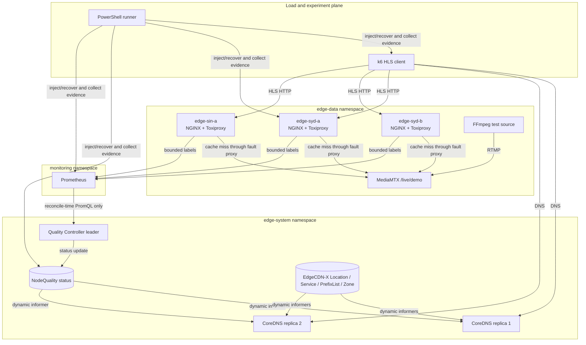

# EdgeRoute architecture

## Scope and ownership

EdgeRoute is a control-and-selection extension to the existing EdgeCDN-X CoreDNS plugin. It does not implement a DNS server, streaming origin, HTTP cache, monitoring system, fault proxy, or load generator.

| Component | Source | EdgeRoute-owned work |
|---|---|---|
| CoreDNS and EdgeCDN-X plugin | upstream | routing modes, NodeQuality informer, immutable snapshot, weighted selection, safety metrics |
| Kubernetes and CRDs | upstream platform | NodeQuality API/schema/status and deployment wiring |
| Prometheus and exporters | mature dependencies | pinned configuration and seven node-scoped PromQL inputs |
| NGINX, MediaMTX, Toxiproxy, k6 | mature dependencies | HLS/cache topology, fault contracts, orchestration, identity checks, result processing |
| Quality Controller | this repository | signal validation, EWMA, ejection safety, state transitions, bounded weight, recovery |

Upstream commits and the exact license boundary are recorded in `UPSTREAM.md` and `NOTICE.md`.

## Runtime topology

The kind cluster has one control-plane and two worker nodes. “Sydney” and “Singapore” are logical labels: two cache Services have fixed lab IPs in Sydney and one fixed lab IP in Singapore, but all run on one workstation.

## Request path

1. EdgeCDN-X resolves the requested Service and chooses a Location using its existing prefix/ECS/Geo behavior.
2. EdgeRoute filters maintenance, alerting, address-family-incompatible, `Disabled`, and `Ejected` candidates.
3. The DNS goroutine loads one immutable NodeQuality snapshot through `atomic.Pointer`; it does not call Prometheus or the Kubernetes API.
4. `adaptive` uses effective weights, `static-rendezvous` uses equal weights, and `deterministic` keeps the upstream modulo-hash control.
5. If no candidate remains, the upstream parent/fallback Location chain is preserved.

The stable selection key is normalized client subnet + normalized DNS name + query type. IPv4 uses `/24`, IPv6 uses `/56`, and EDNS Client Subnet is preferred when available. DNS cannot see HLS URL paths or video/segment identifiers.

## Control path

The controller is the only component that queries Prometheus. Every reconcile:

1. fetches the configured node-scoped latency, error, request, cache, origin, and capacity signals;
2. rejects missing, stale, NaN, infinite, or insufficient-sample input;
3. updates EWMA and outlier counters;
4. applies per-location maximum-ejection and fallback-capacity guards;
5. moves through `Healthy`, `Degraded`, `Ejected`, `Recovering`, `Stale`, `HardStale`, or `Disabled`;
6. publishes a bounded `effectiveWeight` into the NodeQuality status subresource.

Status stores cooldown and recovery progress, so controller restart does not erase the safety state. Lease leader election prevents two active reconcilers from independently updating the same objects.

## DNS TTL, cache state, and recovery

DNS answers use a 30-second lab TTL. Already-resolved clients may continue to use an old node until their resolver cache expires; therefore an immediate weight change cannot recall every active HLS session.

Playlist TTL is 1 second and immutable fMP4 segment TTL is 10 minutes. A recovered Pod starts with an empty cache, so returning it directly to full DNS weight can create an origin spike. EdgeRoute publishes 10%, 25%, 50%, then 100% capacity steps at 30/60/120 seconds. This ramp is a routing safety control; it cannot guarantee origin protection when downstream resolvers ignore TTLs or when client sessions pin an address.

## Observability and cardinality

CoreDNS exports request, route-result, fallback, unavailable-node, selection-duration, and snapshot-age metrics. The controller exports reconcile/state/provider metrics. Labels are drawn from configured server, Location, node, result, state, and reason sets; client IP, qname, video ID, URL, run ID, and exception text are not metric labels.

Experiment identity is stored in files rather than Prometheus labels. Every run records Git SHA, image ID, Job UID, Pod name, k6 run ID, profile, scenario, repetition, timestamps, configuration, and host CPU.

## Failure boundaries

- Prometheus or controller failure does not block DNS; the snapshot moves through stale handling.
- Kubernetes watch interruption leaves the last immutable snapshot readable; readiness reflects initial informer sync.
- Missing NodeQuality CRD is a static fail-open at startup; explicit `Disabled`/`Ejected` states never fail open.
- Node failure is filtered by active health and NodeQuality; Location failure uses upstream parent/fallback order.
- Maximum ejection protects local capacity but can keep a degraded node eligible when ejecting it would remove too much of the Location.
- A kind control-plane failure is outside the single-cluster lab’s high-availability boundary.

Detailed observed behavior and unresolved cases are in `docs/failure-analysis.md`.
