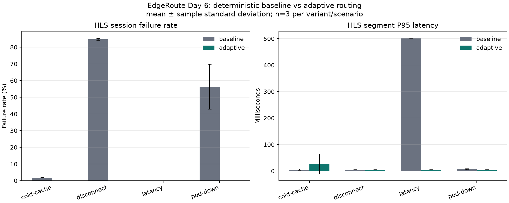

# Day 6 processed results

Generated from immutable files under `../raw/` by `experiments/process_results.py`.
All 24 runs passed the evidence-file, execution-identity, run-ID, and Prometheus telemetry checks; no run was excluded.
Profile: `smoke`. Commit: `6505451e5be5c85b930256b154535f235f63f50d`. CoreDNS image ID: `sha256:a06067e80a5ab8370ab8cba5a1a0dc5dc448ee696aab523286c1d35281fb30ed`.
Host CPU: 12th Gen Intel(R) Core(TM) i5-12400F.
Percentages and latency values are measured results for this recorded profile, not production SLO claims.

| Scenario | Variant | Runs | Playlist success | Segment success | Session failures | Segment P50 | Segment P95 | Segment P99 | Stalls |
|---|---|---:|---:|---:|---:|---:|---:|---:|---:|
| latency | baseline | 3 | 100.00% | 100.00% | 0.00% | 1.27 ms | 502.15 ms | 503.44 ms | 0.0 |
| latency | adaptive | 3 | 100.00% | 100.00% | 0.00% | 1.37 ms | 4.57 ms | 208.81 ms | 0.0 |
| disconnect | baseline | 3 | 26.50% | 100.00% | 84.72% | 1.30 ms | 4.64 ms | 6.79 ms | 0.0 |
| disconnect | adaptive | 3 | 100.00% | 100.00% | 0.00% | 1.16 ms | 4.47 ms | 212.31 ms | 0.0 |
| pod-down | baseline | 3 | 59.90% | 100.00% | 56.39% | 1.43 ms | 6.90 ms | 8.12 ms | 0.0 |
| pod-down | adaptive | 3 | 100.00% | 100.00% | 0.00% | 1.23 ms | 4.43 ms | 290.16 ms | 0.0 |
| cold-cache | baseline | 3 | 99.06% | 100.00% | 1.86% | 1.17 ms | 5.22 ms | 177.72 ms | 0.0 |
| cold-cache | adaptive | 3 | 100.00% | 100.00% | 0.00% | 1.30 ms | 26.65 ms | 338.38 ms | 0.0 |

## Adaptive effect versus baseline

Negative values are improvements for both failure-rate delta and latency change.

| Scenario | Session failure delta | Segment P95 change |
|---|---:|---:|
| latency | +0.00 pp | -99.09% |
| disconnect | -84.72 pp | -3.62% |
| pod-down | -56.39 pp | -35.71% |
| cold-cache | -1.86 pp | +410.51% |

## Interpretation limits

- The `smoke` profile validates the pipeline only (2-5 VUs for 18 seconds); it is not a performance result.
- This comparison has two variants. The baseline combines deterministic modulo hashing, active-health filtering, and fallback; it does not isolate the manual's raw modulo-only baseline as a third policy.
- Three repetitions expose run-to-run spread but are insufficient for production SLO or global-scale claims.
- The kind cluster uses logical Sydney/Singapore regions on one workstation, not real cross-region links.
